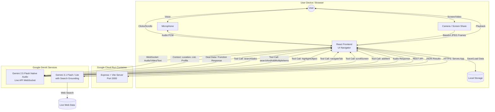

# Chanoch - Gemini Live Agent Challenge Submission


## 🌟 What it does (Elevator Pitch)
**Chanoch** is a next-generation multimodal AI grocery assistant that acts as your personal shopper. By combining real-time voice, vision, and location data, it helps you find the best local deals, manage your shopping lists, and verify health preferences—all through a seamless, hands-free conversational interface. 

Whether you're asking "Where's the cheapest milk near me?" or pointing your camera at a flyer and asking "Are there any deals on these items?", the agent seamlessly integrates real-time voice, vision, and location data to provide instant, actionable results.

**Author:** Enoch Tetteh

## ✨ Key Features & Functionalities
- **🎙️ Live Voice Assistant**: A real-time, interruptible voice agent (powered by Gemini 2.5 Flash Native Audio) that acts as your personal Toronto grocery shopper.
- **👁️ Vision & Smart Scanner**: 
  - Show the Live Agent flyers or products via your camera for real-time analysis.
  - Use the dedicated **Smart Scanner** tab to scan grocery items and instantly check if they align with your health profile (e.g., "Is this keto-friendly?").
- **💰 Real-Time Deal Hunting**: Uses Gemini 3.1 Flash Lite with **Google Search Grounding** to scrape the web for actual, verified grocery prices across major chains and local grocers.
- **📍 Location-Aware**: Integrates with your browser's Geolocation API to prioritize deals and stores physically closest to you.
- **🥗 Personalized Health Profiles**: Set dietary preferences (Vegan, Keto, Halal, etc.), allergies, and health goals. The app and the AI agent tailor their recommendations and warnings based on this profile.
- **📅 AI Meal Planning**: Automatically generate weekly meal plans based on your health profile and the items currently in your grocery list.
- **📝 Smart Grocery List**: A dynamic list that tracks quantities, prices, validity dates, and even provides Google Maps links to the stores where the deals were found.
- **🌍 Multilingual Support**: Fully localized in English and French, with the Live Agent capable of conversing in your preferred language.
- **🛡️ Human-in-the-Loop (HITL)**: The Live Agent strictly asks for your explicit confirmation before modifying your grocery list, updating your profile, or generating meal plans.

## 🛠️ How we built it
- **Frontend**: React 18, Vite, Tailwind CSS, and Framer Motion for an immersive, fluid UI/UX.
- **Backend/Deployment**: Express + Vite server hosted on **Google Cloud Run**.
- **AI & Multimodal**: Google GenAI SDK (`@google/genai`).
  - **Live Agent**: Utilizes `gemini-2.5-flash-native-audio-preview-12-2025` via the Live API WebSocket for real-time, interruptible voice conversations and streaming video frame analysis (Vision & Screen Sharing).
  - **Deal Searching & Grounding**: Utilizes `gemini-3.1-flash-lite-preview` with Google Search Grounding to scrape live web data for verified, real-time grocery prices, preventing hallucinations.
- **Context Awareness**: Integrates the browser's Geolocation API to prioritize deals physically closest to the user.

## 🧠 Agent Architecture & Technical Execution
The agent operates on a robust, multi-layered architecture:
1. **Multimodal Input**: The user interacts via voice (microphone) and vision (camera frames streamed as `image/jpeg`).
2. **Live API Session**: The `LiveAssistant` component maintains a persistent WebSocket connection with the Gemini Live API.
3. **Context Injection**: The agent is continuously fed real-time context, including the user's GPS coordinates and the current state of their shopping list.
4. **Function Calling (Tools)**: The agent is equipped with specific tools:
   - `searchSales`: Triggers a secondary Gemini 3.0 Flash model equipped with Google Search Grounding to scrape the web for actual, verified prices (preventing hallucinations).
   - `addItem`, `removeItem`, `updateItem`, `clearList`: Allows the agent to directly manipulate the user's UI state.
5. **Output**: The agent responds with natural, synthesized voice (audio streaming) and executes UI updates simultaneously.

## 🏗️ Architecture Diagram


## 🆕 Recent Updates & Fixes
### Recent Enhancements
- **Model Upgrade**: Migrated the core deal-hunting and meal planning engine to `gemini-3.1-flash-preview` for complex reasoning, and `gemini-3.1-flash-lite-preview` for fast, lightweight location filtering.
- **Auto-Reconnection**: Implemented robust auto-reconnect logic for the Live API to handle session timeouts and unexpected closures gracefully without interrupting the user experience.
- **UI Navigator Capabilities**: Enhanced the agent's ability to act as a UI Navigator by adding precise spatial highlighting (`highlightObject`) and semantic tab navigation (`navigateTab`).
- **UI/UX Refinements**: Added interactive hover effects to all navigation buttons, list items, and action controls for a more responsive and "crafted" feel.
- **Navigation Optimization**: Reordered the bottom navigation bar to prioritize the "Profile" menu for better accessibility and logical flow.
- **Improved Text Input**: Enabled `autoCorrect` and `spellCheck` on all search, location, and health profile input fields to enhance user data entry efficiency.

### Bug Fixes
- **Camera Stream Leak**: Fixed a race condition and stale closure in the `ScannerView` and `LiveAssistant` components where the camera would remain active in the background if the user navigated away from the page before the camera fully initialized or while it was running.

## 🚀 Spin-up Instructions (Reproducibility)
1. Clone the repository.
2. Ensure you have Node.js installed (v18+ recommended).
3. Run `npm install` to install dependencies.
4. Create a `.env` file in the root directory and add your Gemini API key:
   ```env
   GEMINI_API_KEY=your_api_key_here
   ```
5. Run `npm run dev` to start the development server.
6. Open `http://localhost:3000` in your browser.
7. *Note: For the Live Assistant (voice/camera) and Geolocation to work, the app must be served over HTTPS or accessed via `localhost`.*

## 🧪 Reproducible Testing Instructions

Welcome, Judges! Follow these steps to run Chanoch Grocery locally and experience the Gemini Live Agent capabilities firsthand.

### 1. Prerequisites
*   **Node.js** (v18 or higher)
*   A **Gemini API Key** with access to the Gemini Live API (`gemini-2.5-flash-native-audio-preview-12-2025`) and Gemini 3.1 Flash models.

### 2. Local Setup
1.  **Clone the repository:**
    ```bash
    git clone <your-repo-url>
    cd chanoch-grocery
    ```
2.  **Install dependencies:**
    ```bash
    npm install
    ```
3.  **Configure Environment Variables:**
    Create a `.env` file in the root directory and add your Gemini API key:
    ```env
    GEMINI_API_KEY=your_api_key_here
    ```
4.  **Start the development server:**
    ```bash
    npm run dev
    ```
5.  Open your browser and navigate to `http://localhost:3000`. *(Note: Please ensure you grant Microphone, Camera, and Location permissions when prompted, as they are required for the multimodal and location-aware features).*

---

### 3. Testing Scenarios (How to test the features)

To fully experience the Live Agent, click the **Microphone/Live** button to start a session, and try the following scenarios:

#### Scenario 1: Hands-Free UI Navigation
*   **Action:** Speak to the agent and say, *"Show me my meal plan,"* or *"Navigate to my health profile."*
*   **Expected Result:** The agent will autonomously trigger the `onNavigateTab` tool and physically switch the UI tabs on your screen without you touching the mouse. You can also say *"Scroll down"* to test the scrolling tool.

#### Scenario 2: Multimodal Vision & The "Digital Laser Pointer"
*   **Action:** Click the **Camera** icon to enable your video feed. Hold up a grocery item (e.g., a piece of fruit or a pantry item) to the camera. Ask the agent, *"What is this, and can you highlight it for me?"*
*   **Expected Result:** The agent will use its vision capabilities to identify the item and trigger the `onHighlightObject` tool, drawing a pulsing green circle directly over the item on your screen.

#### Scenario 3: Budget-Constrained Meal Planning (Reasoning & Search)
*   **Action:** Say, *"Create a 3-day meal plan for 2 people with a budget of $40."*
*   **Expected Result:** The agent will use Google Search Grounding to check current ingredient prices, calculate the estimated total, and generate a meal plan. If the plan exceeds $40, it will issue a `budgetWarning` and suggest cheaper alternatives.

#### Scenario 4: Location-Aware Deal Hunting
*   **Action:** Ensure your location permissions are granted. Ask the agent, *"Find me the best deal for a gallon of milk nearby."*
*   **Expected Result:** The agent will read your injected GPS coordinates, filter for grocery stores actually located in your region, and use the `onSearchSales` tool to find and read out the best local price.

#### Scenario 5: Autonomous Multilingual UI Switching
*   **Action:** Speak to the agent in Spanish (e.g., *"Hola, ¿puedes ayudarme a comprar comida?"*) or French.
*   **Expected Result:** The agent will detect the language change, respond in that language, and autonomously trigger the `onSetAppLanguage` tool to instantly translate the entire application's UI text to match your spoken language.

## 💡 Learnings & Findings
- **Speed vs. Accuracy**: We learned that forcing the AI to search for deals can sometimes be slow. We optimized this by instructing the agent to simplify search queries (e.g., "tomato paste" instead of "small size tomato paste") and limiting the JSON output size to prevent truncation.
- **Multimodal Context**: Combining location data with voice and vision creates a significantly more powerful agent. The AI isn't just answering questions; it's answering questions *relevant to where the user is standing*.
- **Handling Interruptions**: The Live API's native ability to handle interruptions makes the voice agent feel incredibly natural, much like a real human assistant.

## 🏆 Challenge Categories Targeted
- **UI Navigator 🖱️**: The agent demonstrates visual precision by observing the screen (via screen share), highlighting specific UI elements, and executing semantic actions (navigating tabs, scrolling, expanding items) without relying on brittle "blind clicking".
- **Live Agents 🗣️**: Real-time, interruptible voice and vision interaction using the Gemini 2.5 Flash Native Audio Live API.
- **Best Multimodal Integration & User Experience**: Seamless blending of voice, vision, location, and a highly polished UI.
- **Best Technical Execution & Agent Architecture**: Complex tool use, context management, and search grounding integration.

## 📄 License
This project is licensed under the Apache License 2.0 - see the [LICENSE](LICENSE) file for details.

---
Built with ❤️ by Enoch Tetteh
