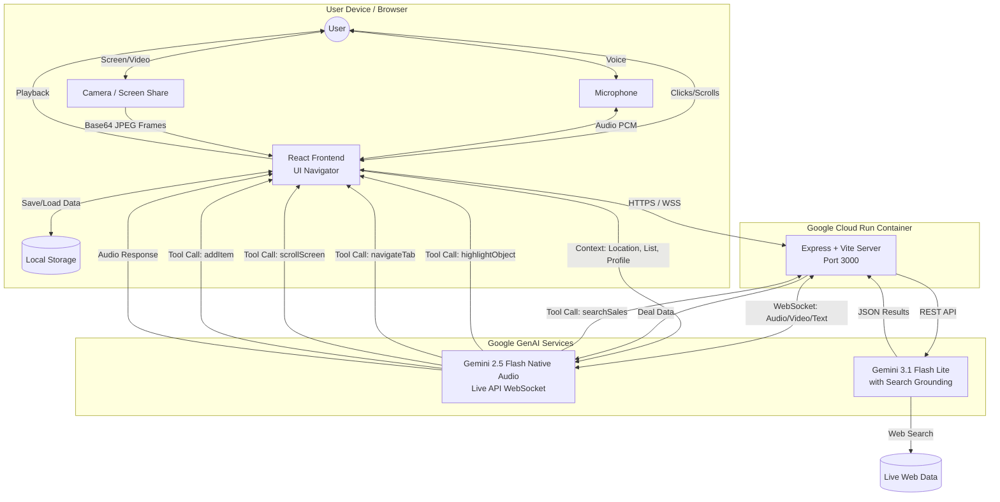

# Grocery Scout Architecture

```mermaid
graph TD
    subgraph Client [User Device / Browser]
        User((User))
        UI[React Frontend\nUI Navigator]
        Camera[Camera / Screen Share]
        Mic[Microphone]
        LocalStorage[(Local Storage)]
    end

    subgraph GoogleCloud [Google Cloud Run Container]
        AppServer[Express + Vite Server\nPort 3000]
    end

    subgraph GeminiAPIs [Google GenAI Services]
        GeminiLive[Gemini 2.5 Flash Native Audio\nLive API WebSocket]
        GeminiFlash[Gemini 3.1 Flash Lite\nwith Search Grounding]
    end

    User <-->|Voice| Mic
    User <-->|Screen/Video| Camera
    User <-->|Clicks/Scrolls| UI

    Mic <-->|Audio PCM| UI
    Camera -->|Base64 JPEG Frames| UI
    UI <-->|Save/Load Data| LocalStorage

    UI <-->|HTTPS / WSS| AppServer

    AppServer <-->|WebSocket: Audio/Video/Text| GeminiLive
    
    UI -->|Context: Location, List, Profile| GeminiLive
    
    GeminiLive -->|Tool Call: searchSales| AppServer
    AppServer -->|REST API| GeminiFlash
    GeminiFlash -->|Web Search| Internet[(Live Web Data)]
    GeminiFlash -->|JSON Results| AppServer
    AppServer -->|Deal Data| GeminiLive
    
    GeminiLive -->|Tool Call: highlightObject| UI
    GeminiLive -->|Tool Call: navigateTab| UI
    GeminiLive -->|Tool Call: scrollScreen| UI
    GeminiLive -->|Tool Call: addItem| UI
    
    GeminiLive -->|Audio Response| UI
    UI -->|Playback| User
```
